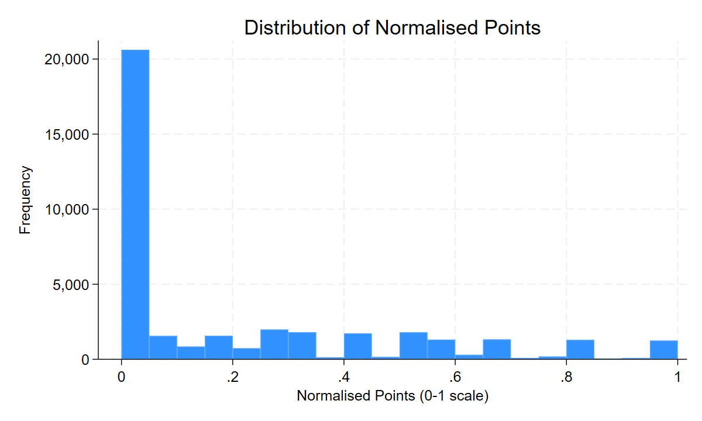

# Eurovision Voting & Economic Proximity: A Gravity Model Analysis

## Regression Results

### Executive Summary
Is Eurovision merely a musical contest, or do exchanged votes mean something more? This project tests whether economic 
and cultural proximity predicts how countries vote for one another. Using an augmented gravity model framework to 
analyse Eurovision voting data, we find strong evidence that it does. Diaspora communities vote for their home countries
, while cultural blocs such as Scandinavia vote cohesively as a group. This suggests cultural exchange is driven by 
friction — exposure, geographic connection, and shared history. Strikingly, these cultural effects are concentrated 
almost entirely within the public televote, hinting at a real divide in how the public and the experts judge the 
contest. The effect of economic mass (GDP) is harder to determine. Economic integration between countries is a 
significant driver, but short-run changes in economic size are not — with the time-invariant component of GDP, plausibly
reflecting a country's underlying production capacity and music industry strength, absorbed into the country fixed 
effects.

### Data and Methodology
A directed bilateral panel dataset of Eurovision voting history was compiled, incorporating migration, trade, and GDP 
data alongside geographic and linguistic variables to enable econometric analysis. The panel structure and methodology 
of preparing this dataset are explored in full within the [README](../README.md) file of this project. 

The gravity model — developed by Tinbergen (1962) for bilateral trade flows — posits that bilateral interaction 
increases with the economic mass of two entities and decreases with the friction between them. While originally applied 
to trade, the framework generalises to any bilateral flow context. We adapt this model for Eurovision voting, where GDP 
proxies for mass — on the basis that larger economies plausibly support stronger music industries and greater 
broadcasting capacity, giving entries a production advantage independent of the underlying voting relationship. Weighted
distance captures geographic friction augmented with cultural, migration, and geopolitical variables that capture 
additional elements of bilateral friction — some reducing it (shared language, diaspora communities, former political 
union, trade integration) and some, counterintuitively, increasing it (GDP similarity). 

The regression approach begins with a partial baseline specification capturing the friction component of the gravity 
framework — geographic and linguistic variables — without an explicit mass term. Economic variables, migration stocks, 
and geopolitical bloc dummies are then added progressively, allowing the contribution of each variable group to be 
identified separately and revealing how coefficients interact across specifications. Normalised points serve as the 
primary dependent variable throughout, with separate jury and televote specifications — available since their 
introduction in 2016 — used to investigate the jury/televote divergence documented in the findings.

We estimate using the ordinary least squares method, including sender country, recipient country and year fixed effects.
This is estimated using the Frisch-Waugh-Lovell theorem via the reghdfe command in Stata, with robust standard errors 
throughout. This ensures that coefficients on time-varying covariates reflect within-pair variation over time rather 
than stable cross-sectional differences between country pairs.

Eurovision voting data is censored at 0. As such, a Tobit specification without fixed effects is included as a 
robustness check. Statistical significance is evaluated at standard thresholds (1%, 5%, and 10%).

### Descriptive Statistics
Key outcome variables and covariates are summarised in Table 1 and 2 respectively. 

#### Table 1: Outcome Variables
| Variable          | Obs    | Mean | Std. Dev. | Min | Max |
|-------------------|--------|------|-----------|-----|-----|
| Total Points      | 38,781 | 3.00 | 4.30      | 0   | 24  |
| Televote Points   | 9,849  | 2.31 | 3.54      | 0   | 12  |
| Jury Points       | 9,849  | 2.31 | 3.54      | 0   | 12  |
| Normalised Points | 38,781 | 0.21 | 0.28      | 0   | 1   |

#### Table 2: Key Covariates

| Variable                | Obs    | Mean      | Std. Dev.  | Min    | Max       |
|-------------------------|--------|-----------|------------|--------|-----------|
| Weighted Distance (km)  | 36,493 | 1,932.80  | 1,915.11   | 160.93 | 17,625.29 |
| Migrant Stock           | 20,619 | 32,567.42 | 152,003.90 | 0      | 3,551,965 |
| Migration Intensity     | 20,619 | 0.0026    | 0.0111     | 0      | 0.3784    |
| GDP, Sender (USD bn)    | 31,950 | 476.23    | 802.31     | 1.42   | 5,452.86  |
| GDP, Recipient (USD bn) | 32,237 | 599.66    | 935.14     | 1.62   | 5,452.86  |
| GDP Similarity          | 31,194 | 0.7699    | 0.1828     | 0.0826 | 0.9999    |
| Trade Openness          | 23,510 | 0.0032    | 0.0063     | ~0     | 0.0974    |

Normalised points are heavily censored at zero: 52% of all bilateral voting observations record no points exchanged 
(Figure 1), motivating the Tobit specification used as a robustness check in this analysis.

#### Figure 1: Distribution of Normalised Points

Table 3 presents the correlation matrix for key continuous variables. Notably, GDP similarity and log trade openness are
moderately correlated (r = 0.57), motivating the multicollinearity caution flagged in Finding 2.

#### Table 3: Correlation Matrix

| Variable             | Normalised Points | Distance | Migrant Stock | Migration Intensity | GDP (Sender, log) | GDP (Recipient, log) | GDP Similarity | Trade Openness (log) |
|----------------------|-------------------|----------|---------------|---------------------|-------------------|----------------------|----------------|----------------------|
| Normalised Points    | 1.00              |          |               |                     |                   |                      |                |                      |
| Distance             | -0.04             | 1.00     |               |                     |                   |                      |                |                      |
| Migrant Stock        | 0.15              | -0.02    | 1.00          |                     |                   |                      |                |                      |
| Migration Intensity  | 0.19              | -0.05    | 0.33          | 1.00                |                   |                      |                |                      |
| GDP (Sender, log)    | -0.01             | 0.09     | 0.21          | -0.05               | 1.00              |                      |                |                      |
| GDP (Recipient, log) | 0.00              | 0.06     | 0.08          | 0.11                | 0.05              | 1.00                 |                |                      |
| GDP Similarity       | 0.01              | 0.00     | 0.06          | -0.06               | 0.44              | 0.16                 | 1.00           |                      |
| Trade Openness (log) | 0.19              | -0.32    | 0.22          | 0.15                | 0.42              | 0.38                 | 0.57           | 1.00                 |

#### Table 4: Dummy Variable Frequencies
Table 4 summarises the prevalence of each binary covariate across the sample. Most cultural and colonial linkages are 
rare — present in under 10% of observations — with the notable exception of shared EU membership, present in 27.13% of 
country-pair-years.

| Variable                         | N      | Share = 1 (%) |
|----------------------------------|--------|---------------|
| Shared Border                    | 36,493 | 9.47          |
| Shared Official Language         | 36,493 | 6.13          |
| Shared Ethnological Language     | 36,493 | 5.91          |
| Colonial Link                    | 36,493 | 3.62          |
| Common Coloniser after 1945      | 36,493 | 2.25          |
| Current Colonial Relationship    | 36,493 | 0.32          |
| Colonial Relationship since 1945 | 36,493 | 1.52          |
| Historically Same Country        | 36,493 | 2.07          |
| Former Soviet (Both)             | 38,781 | 2.67          |
| Former Yugoslav (Both)           | 38,781 | 0.67          |
| Scandinavian (Both)              | 38,781 | 2.10          |
| Balkan (Both)                    | 38,781 | 2.89          |
| EU Membership (Both)             | 38,781 | 27.13         |

### Results
Results are reported from Model 4 — the full specification including geographic, economic, migration and geopolitical 
variables with sender, receiver and year fixed effects — unless otherwise stated. Normalised points are used as the dependent variable. These are given on a scale
of 0 to 1, where 0 corresponds to the country giving 0 points and 1 corresponds to the country giving the maximum points
available in that year.

#### Table 5: Regression Results — Models 1–4

| Variable                         | Model 1           | Model 2           | Model 3           | Model 4           |
|----------------------------------|-------------------|-------------------|-------------------|-------------------|
| Weighted Distance                | -0.000*** (0.000) | -0.000*** (0.000) | -0.000*** (0.000) | -0.000*** (0.000) |
| Shared Border                    | 0.060*** (0.007)  | 0.059*** (0.010)  | 0.027*** (0.010)  | 0.024** (0.010)   |
| Shared Official Language         | 0.005 (0.009)     | 0.038*** (0.013)  | 0.032** (0.015)   | 0.032** (0.015)   |
| Colonial Link                    | 0.111*** (0.010)  | 0.100*** (0.013)  | 0.050*** (0.014)  | —                 |
| GDP, Sender (log)                | —                 | -0.007 (0.010)    | -0.006 (0.012)    | -0.004 (0.012)    |
| GDP, Recipient (log)             | —                 | -0.006 (0.010)    | 0.008 (0.011)     | 0.009 (0.012)     |
| GDP Similarity                   | —                 | -0.244*** (0.016) | -0.252*** (0.020) | -0.239*** (0.020) |
| Trade Openness (log)             | —                 | 0.052*** (0.002)  | 0.057*** (0.003)  | 0.049*** (0.003)  |
| Migration Intensity              | —                 | —                 | 3.010*** (0.343)  | 2.544*** (0.320)  |
| Colonial Relationship since 1945 | —                 | —                 | —                 | 0.086*** (0.022)  |
| Former Soviet (Both)             | —                 | —                 | —                 | 0.068*** (0.015)  |
| Former Yugoslav (Both)           | —                 | —                 | —                 | 0.204*** (0.041)  |
| Scandinavian (Both)              | —                 | —                 | —                 | 0.167*** (0.019)  |
| Balkan (Both)                    | —                 | —                 | —                 | -0.023 (0.015)    |
| EU Membership (Both)             | —                 | —                 | —                 | -0.010 (0.007)    |
| Constant                         | 0.303*** (0.006)  | 0.846*** (0.078)  | 0.792*** (0.093)  | 0.718*** (0.094)  |
| Observations                     | 36,493            | 22,265            | 17,197            | 17,197            |
| Within R²                        | 0.040             | 0.092             | 0.108             | 0.116             |

*a Robust standard errors in parentheses. \* p<0.10, \*\* p<0.05, \*\*\* p<0.01. All specifications include sender, 
receiver and year fixed effects.*

*b Weighted distance coefficients are rounded to three decimal places for table consistency; full precision is reported
in Finding 1 (e.g. -0.0000133 in the full specification).*

*c Colonial Link is replaced by the more specific Colonial Relationship since 1945 in the full specification, 
see Robustness section.*

#### Finding 1: Geographic and cultural proximity predict voting
The baseline model explains 3.94% of within-variation in normalised points, suggesting that geographic and cultural 
proximity have statistically significant explanatory power beyond time-invariant country characteristics. Geographic 
proximity is significant. A 1000km increase in weighted distance between countries corresponds to an expected decrease 
of 0.0133 normalised points. Following the same trend, sharing a border is expected to increase normalised points by 
0.0236. This coefficient notably drops however between specifications from 0.06 to 0.024 when migration intensity enters
the equation – a 60% reduction.

Cultural proximity is also significant. A colonial relationship since 1945 corresponds with an expected 0.086 increase 
in normalised points, significant at the 1% level. Shared official language also has a positive coefficient of 0.032, 
though this only becomes significant once economic variables are added. This alongside the change in the shared border 
coefficient suggests the baseline model estimates suffered from omitted variable bias.

#### Finding 2: Economic integration matters, but short-run changes in economic size does
Upon adding economic and size controls, within-R² more than doubles from 3.94% to 9.17%. GDP variables are insignificant
across all specifications, suggesting short-run changes in economic size confer no voting advantage. This is broadly 
consistent with modern structural gravity practice, where mass terms, varying only by country, are frequently weakly 
identified or omitted entirely once country-level fixed effects are properly specified. This leaves open whether 
cultural exchange would show a genuine mass effect under a specification that preserves cross-country GDP variation, 
a question beyond the scope of the fixed-effects design used here.

However, economic integration and relative economic size — pair-level constructs that aren't stripped away by fixed 
effects in the same manner as GDP — are both significant predictors, though in contrasting directions. A doubling of 
trade openness corresponds to an expected 0.034 increase in normalised points (significant at the 1% level), suggesting
economically integrated country pairs systematically award each other more votes. A 10-percentage point increase in GDP
similarity corresponds to a 0.0239 decrease in normalised points (significant at the 1% level). This negative 
coefficient is counterintuitive — that countries of similar economic size give each other fewer points.

It should be acknowledged, given the high correlation between GDP similarity and trade openness (r = 0.57), both these 
coefficients should be interpreted with caution given likely multicollinearity. Further investigation is warranted to 
confirm genuine relationships.

#### Finding 3: Migration intensity is a strong predictor of voting
Migration intensity is a strong predictor of voting, significant at the 1% level. A one standard deviation increase in 
migration intensity (0.011) corresponds to a 0.028 increase in normalised points — equivalent to roughly 14% of the mean
normalised score. This effect is entirely concentrated within the televote (Table 6). Within the televote specification
the migration intensity coefficient is equal to 51.65 (significant at the 1% level) compared to -1.44 within the jury 
vote specification (statistically insignificant, p=0.88) — a striking divergence that provides the clearest evidence for
the diaspora hypothesis.

#### Table 6: Regression Results — Normalised, Jury, and Televote Points

| Variable                         | Normalised Points | Jury Points       | Televote Points   |
|----------------------------------|-------------------|-------------------|-------------------|
| Weighted Distance                | -0.000*** (0.000) | -0.000** (0.000)  | -0.000*** (0.000) |
| Shared Border                    | 0.024** (0.010)   | -0.154 (0.225)    | 0.168 (0.220)     |
| Shared Official Language         | 0.032** (0.015)   | 0.456 (0.315)     | 0.484* (0.286)    |
| Colonial Relationship since 1945 | 0.086*** (0.022)  | 2.109*** (0.638)  | 1.543*** (0.562)  |
| GDP, Sender (log)                | -0.004 (0.012)    | -0.218 (0.636)    | 0.285 (0.601)     |
| GDP, Recipient (log)             | 0.009 (0.012)     | -1.907*** (0.565) | -0.874* (0.512)   |
| GDP Similarity                   | -0.239*** (0.020) | -1.005* (0.522)   | -4.428*** (0.465) |
| Trade Openness (log)             | 0.049*** (0.003)  | 0.341*** (0.066)  | 0.665*** (0.060)  |
| Former Soviet (Both)             | 0.068*** (0.015)  | 0.339 (0.316)     | 0.555* (0.301)    |
| Former Yugoslav (Both)           | 0.204*** (0.041)  | 0.597 (1.314)     | 6.389*** (0.852)  |
| Scandinavian (Both)              | 0.167*** (0.019)  | 0.644 (0.421)     | 1.882*** (0.485)  |
| Balkan (Both)                    | -0.023 (0.015)    | -0.407 (0.399)    | -0.951*** (0.364) |
| EU Membership (Both)             | -0.010 (0.007)    | -0.253 (0.218)    | -0.187 (0.211)    |
| Migration Intensity              | 2.544*** (0.320)  | -1.435 (9.509)    | 51.650*** (9.367) |
| Constant                         | 0.718*** (0.094)  | 18.062*** (4.750) | 14.414*** (4.438) |
| Observations                     | 17,197            | 5,921             | 5,921             |
| Within R²                        | 0.116             | 0.029             | 0.121             |

*a Robust standard errors in parentheses. \* p<0.10, \*\* p<0.05, \*\*\* p<0.01. All specifications include sender, 
receiver and year fixed effects.*

*b Weighted distance coefficients are rounded to three decimal places for table consistency; full precision is reported
in Finding 1 (e.g. -0.0000133 in the full specification).*

*c Jury and Televote points are given on a scale of 0-12, while normalised points are given on a scale of 0-1.*

#### Finding 4: Bloc voting exists in some cases though not in all
Former Yugoslavia, the Scandinavian countries and former soviet countries vote as cohesive political and cultural units
in the modern era. The strongest of these blocs is former Yugoslavia, where both countries sharing previous membership,
corresponds with an expected 0.2042 point increase in normalised points, significant at the 1% level. This is present to
a smaller degree within Scandinavia corresponding to an expected 0.1668 increase, and less so within former soviet 
countries corresponding to an expected 0.0683 increase (both significant at the 1% level). Other cultural and political 
blocs are statistically insignificant such as Balkan countries, possibly due to a too broad definition or former 
Yugoslavia being controlled for, as well as EU member states.

These cultural bloc effects seem entirely concentrated within the televote (Table 6). Former Yugoslavia, former soviet 
and Scandinavia bloc coefficients are statistically insignificant within the jury vote specification (p=0.65, p=0.283, 
p=0.126).

### Robustness
The core findings remain robust across a range of alternative specifications.

The migration intensity coefficient remains virtually constant (2.5284 vs 2.5443) when restricting the sample to 
observations where migration data is sourced from UN DESA, confirming that the Eurostat supplement does not drive the 
migration intensity finding. However, restricting the sample to Eurostat observations alone is inconclusive, given 
there are only 1,483 observations leading to several variables dropping due to collinearity. The sample is too small to 
draw meaningful conclusions from this subset alone. Migration remains statistically significant at the 1% level when 
utilising migrant stock as the independent variable rather than migration intensity. This suggests it is the underlying 
diaspora phenomenon rather than the construction of the migration intensity variable that drives this finding.

With 52% of observations recording zero-point exchanges, a Tobit robustness check is warranted. The consistency of 
coefficient signs and significance levels across both specifications supports the validity of the OLS fixed effects 
results. The notable exception is the coefficient on weighted distance, which becomes positive in the Tobit 
specification, likely reflecting omitted variable bias in the absence of country and year fixed effects. This supports 
our use of OLS with fixed effects as the primary specification.

Coefficient signs and significance levels remain near-identical when restricting observations to the 21st century, 
further supporting the robustness of our findings to early years with patchy data coverage.

As a further check on specification choice, the colonial link variable was decomposed into more specific measures — 
colonial relationship since 1945, common coloniser after 1945, and historically same country. Only colonial relationship
since 1945 remains significant (0.099, significant at the 1% level). This is consistent with a recency logic: 
relationships formed or maintained since 1945 capture active diplomatic, migratory and cultural ties, whereas common 
colonisers or historically shared statehood may reflect ties too distant to shape contemporary voting behaviour. This
motivates its use as the preferred colonial proxy over the broader colonial link variable in the full specification.

Taken together, these checks suggest the core findings — particularly the strength of the migration and diaspora effect 
— are not artefacts of data source, model choice, sample period, or variable specification.

### Discussion
The results presented above suggest that Eurovision is not purely a musical competition — bilateral voting patterns are 
associated with friction components (geographic, cultural, and economic effects), though the effect of economic mass 
(GDP) is harder to determine.

Among the friction terms, we find higher levels of economic similarity correspond to lower levels of normalised points.
This is initially surprising. One candidate explanation is structural — the Big 5 countries (France, Germany, Italy, 
Spain and the United Kingdom) automatically progress to the grand final regardless of song quality and have, in recent 
years (except for Italy), performed poorly within the contest, artificially compressing the GDP similarity coefficient.
For example, apart from Sam Ryder's second place finish in 2022, the United Kingdom has consistently scored in the lower
half of the leaderboard throughout the past decade. However, excluding the Big 5 recipients leaves the GDP similarity 
coefficient virtually unchanged (-0.206 vs -0.239), ruling this out as the primary driver.

A more compelling, though untested, explanation lies in the direction of diaspora flows. Migration tends to flow 
asymmetrically from lower- to higher-GDP countries; if this asymmetry drives the diaspora effect identified above, we 
expect weaker effects between economically similar countries, where migration flows are more balanced and smaller in 
absolute terms — consistent with the negative GDP similarity coefficient. This warrants further investigation.

Similarly, the Scandinavian bloc coefficient is positive (0.1668) and significant (at the 1% level), as are the former 
Soviet and former Yugoslav coefficients (0.0683, 0.2042 respectively — significant at the 1% level). This is consistent
with cultural factors such as former political union shaping bloc voting behaviour. However, by contrast, the Balkan 
bloc is insignificant across all specifications. This persists even when former_yugoslav is excluded from the model 
(p=0.783), suggesting it is not simply due to this subset of countries being controlled for. Two explanations present 
themselves: the Balkan definition used was too broad, encompassing historically hostile pairs such as Greece and Turkey;
or the Balkan region simply does not exhibit the same cohesive voting solidarity as Scandinavia. This would suggest that
regional groupings alone are an insufficient driver of voting without the shared institutional bonds which characterise
the Nordic bloc. Nor does economic and cultural union, beyond that which geography and trade capture, appear to 
translate into a voting advantage — the insignificance of EU membership across all specifications is consistent with 
this.

Yet the strength and nature of the cultural and economic effects vary markedly between the public televote and 
professional jury. The within R² of 12% in the televote specification compared to just 3% in the jury specification 
indicates that the factors captured by our model explain four times more variation in public votes than professional 
jury votes, consistent with diaspora and cultural bloc effects being concentrated almost entirely within the televote. 
Jury points are more robust to cultural and geographic proximity, suggesting professional juries evaluate entries on 
criteria less correlated with bilateral relationships.

This has implications for Eurovision as an institution. If the EBU desires to reduce cultural and geographic voting 
patterns, it has a lever for doing so — increasing jury weight, which would likely reduce, though not eliminate, 
cultural and economic effects, as trade openness and colonial relationship since 1945 remain significant in the jury 
model. The EBU implemented this in the 2026 edition of the contest, where jury voting was re-introduced to the 
semi-finals. However, this lever is constrained by commercial reality. Increasing jury weight means reducing televoting
weight — a significant revenue stream for the EBU and a primary driver of audience engagement — making the extensive use
of this lever unrealistic.

A broad implication of these wider findings concerns the gravity framework itself. Our results suggest that in cultural
exchange, the friction component is robustly significant — geographic proximity, shared history, diaspora communities, 
and political union all predict voting patterns — while mass effects are harder to pin down (see limitations). This 
asymmetry is itself a useful methodological takeaway for extending gravity-style frameworks beyond trade: friction terms
, being pair-specific, travel well under fixed-effects designs, while mass terms require either a different 
specification or a clear theoretical case for why the mass channel would operate on a shorter time horizon than the one 
available to the data.

Even the presence of friction effects alone arguably does impede the integrity of the contest, though this doesn't 
necessarily constitute a problem. Migrant communities voting for their home countries could be argued to be a form of 
cultural expression that shouldn't be restricted. Moreover, our findings suggest that these factors alone cannot secure
a win — even within the televote, 88% of within-voting variation is not explained by our model. Even if economic and 
cultural factors are in your favour, it's statistically difficult to win without factors not controlled for in this 
model, such as musical merit.

Though the application of the augmented gravity model to Eurovision may appear trivial, the contest provides desirable 
grounds for study through creating a clean bilateral environment. Voting is frequent, public and free from diplomatic 
confounding factors like private negotiation and abstentions which typically characterise most bilateral voting contexts.
The friction-focused gravity framework used here could arguably prove applicable to analysing voting in the UN General 
Assembly or EU Council, where disentangling genuine policy alignment — like musical merit — from cultural and geographic
solidarity remains methodologically challenging. In any case, our findings go beyond merely establishing friction 
components such as geographic, cultural and economic proximity as factors which affect the Eurovision Song Contest. 
Rather, they indicate these factors are important determinants of cultural bilateral exchange more broadly, offering a 
lens on how country populations express connection to one another through a low-stakes public forum.

### Limitations
While our dataset contains a full record of Eurovision country votes, our regressions are practically limited to a 21st
century subset due to covariate availability detailed in the data sources section. While our robustness checks confirm 
findings hold within this subset, the effect of cultural and economic factors may nonetheless be inflated, given the 
introduction of the televote in the 2000s. According to our findings, previous iterations of the contest were likely 
affected less by cultural and economic factors given voting was decided entirely by juries.

Our data is censored at 0 and includes time-invariant unobserved heterogeneity (e.g. Sweden being a historically popular
country in Eurovision) necessitating fixed effects. However, due to computational constraints in estimating a Tobit 
model with high-dimensional fixed effects, we rely on an OLS specification as our primary model.

While sender, receiver and year fixed effects control for time-invariant unobserved heterogeneity, time-varying shocks 
specific to a country each year may still confound these estimates. Since the Gaza war in 2023, the Israeli delegation 
has received high public vote results, scoring 1st and 3rd in the televote in 2025 and 2026 respectively, diverging from
its 14th and 8th place in the jury vote rankings.

Our use of sender and recipient fixed effects means that country-level variables, such as the GDP coefficients reported
above, capture only the effect of within-country fluctuation on voting, not persistent cross-country differences — 
much of which is absorbed into the country fixed effects themselves. This is a known feature of gravity models rather 
than a specific weakness of this analysis, but it means our finding that GDP is insignificant should not be read as 
ruling out a role for economic mass in cultural exchange generally — only that we find no evidence of a short-run 
effect, net of each country's average standing in the contest.

The geopolitical dataset used to construct cultural blocs was independently compiled without external validation. 
Definitional choices — such as which countries constitute the Balkan bloc and when the UK should be coded as having 
left the EU — reflect judgements made by the author and may not align with alternative classifications in the literature.
This may partly explain the insignificance of the Balkan bloc coefficient, as discussed above.

### Conclusions
This project sought to investigate the extent to which cultural and economic proximity predicts Eurovision voting 
patterns. Our regression model suggests this to be the case, with a within R-squared of 11.6% in our final model 
specification. This effect is primarily driven by the televote rather than the jury, through factors such as diaspora 
communities voting for their home country, though even within jury voting, variables such as colonial relationship 
since 1945 and trade openness remain significant at the 1% level. Notably, former political union — in the form of blocs
such as Scandinavia, former Soviet states, and former Yugoslav states — matters more than broader regional groupings 
such as EU membership. Moreover, economic integration — measured through trade — is a robust predictor of voting, while 
short-run changes in economic size are not. Interpreted through the gravity framework, these findings show friction — 
exposure, geographic connection, and shared history — to be a reliably identified determinant of cultural exchange.

These findings align with Ginsburgh & Noury (2008), who similarly find no evidence of reciprocal vote-trading but cannot
rule out cultural voting. Our results extend this work by directly modelling the channels through which cultural and 
economic proximity appear to shape voting patterns, nearly two decades after their original analysis. More broadly, 
these results point toward a friction-focused specification as a promising tool for other bilateral voting contexts — 
such as the UN General Assembly or EU Council — where the same challenge of separating genuine alignment from cultural 
and geopolitical solidarity applies.

This project provides multiple avenues for future research: a Tobit specification with pair fixed effects if 
computationally feasible; a specification preserving cross-country GDP variation (e.g. pooled or between-effects) to 
test whether a genuine mass effect exists beyond the short-run fluctuations identified here; and extension of the 
friction-focused augmented gravity framework to other bilateral voting contexts such as the UN or EU.

### References
Ginsburgh, V. & Noury, A. G. (2008). The Eurovision Song Contest: Is voting political or cultural? *European Journal of Political Economy*, 24(1), 41–52. https://doi.org/10.1016/j.ejpoleco.2007.05.004

Tinbergen, J. (1962). *Shaping the World Economy: Suggestions for an International Economic Policy*. Twentieth Century Fund.

